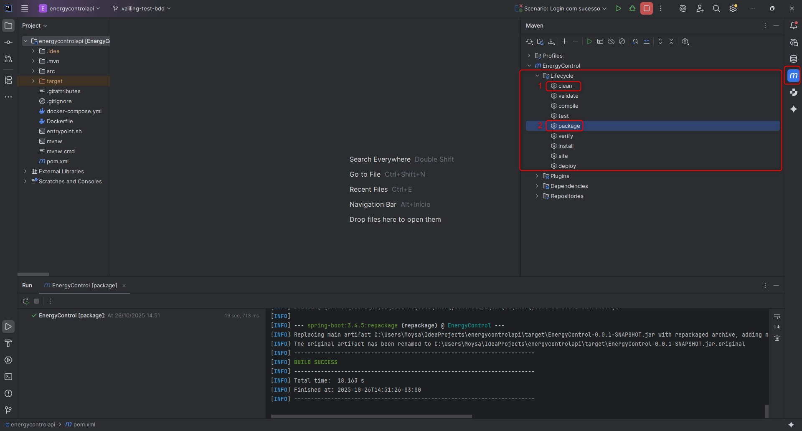

## Energy Control API

Esta é uma API de back-end para um sistema de gerenciamento de consumo de energia, desenvolvida em Spring Boot. O projeto é totalmente containerizado com Docker e Docker Compose para facilitar a execução e o gerenciamento de dependências, incluindo um banco de dados Oracle.

### Pré-requisitos

Antes de começar, garanta que você tenha as seguintes ferramentas instaladas em sua máquina:

*   **Docker e Docker Compose** (Geralmente incluídos no Docker Desktop)
*   **Git** (para clonar o repositório)
*   **IntelliJ IDEA** (IDE para trabalhar com Java)
*   **Docker Desktop** (para gerenciar containers, importante para quem utilza Windows)

### Como Executar

Siga os passos abaixo para clonar, construir e executar a aplicação e seu banco de dados.

**1. Clonar o Repositório**

Abra seu terminal e clone o repositório do projeto:

```bash
git clone https://github.com/ThiagoFdaSLopes/energycontrolapi.git
```

**2. Build do Projeto com Maven no IntelliJ**

Antes de iniciar os containers Docker, é crucial construir o projeto para que o arquivo `.jar` seja gerado. O Docker irá utilizá-lo para criar a imagem da aplicação.

1.  Abra o projeto `energycontrolapi` no IntelliJ IDEA.
2.  No menu lateral direito, encontre o ícone do **Maven**.
3.  Acesse a pasta **Lifecycle**.
4.  Primeiro, dê dois cliques em `clean` para limpar builds anteriores e, depois, dois cliques em `package` para compilar e empacotar o projeto.
5.  Após a conclusão, a pasta `target` será criada na raiz do projeto, contendo o arquivo `EnergyControl-0.0.1-SNAPSHOT.jar`, que o Docker precisará para executar o container com sucesso.

Exemplo:


**3. Navegar até o Diretório**

Entre na pasta do projeto que você acabou de clonar:

```bash
cd energycontrolapi
```
*(Este diretório é o que contém o arquivo `docker-compose.yml`)*

**4. Construir e Iniciar os Containers**

Caso utilize `Windows`, abra o Docker Desktop, e depois rode o comando abaixo.
Este comando irá baixar a imagem do banco de dados, construir a imagem da sua API (a partir do `Dockerfile`) e iniciar ambos os containers em segundo plano.

```bash
docker compose up -d
```

**5. Verificar a Execução**

Para garantir que tudo está rodando corretamente, liste os containers em execução:

```bash
docker ps
```

Você deverá ver dois containers com o status "Up" (ou "running"):

*   `energy-control-app` (ou o nome que você definiu)
*   `oracle-db`

### Autenticação

A API utiliza autenticação baseada em token JWT. Para consumir a maioria dos endpoints, você deve primeiro se autenticar para obter um token de acesso.

**1. Obter o Token de Acesso**

Use uma ferramenta como Postman ou Insomnia para fazer uma requisição `POST` ao endpoint de login:

*   **Método:** `POST`
*   **URL:** `http://localhost:8080/auth/login`
*   **Body (raw/JSON):**
    ```json
    {
      "email": "admin@exemplo.com",
      "password": "admin"
    }
    ```

**2. Usar o Token**

A resposta desta requisição incluirá um token. Copie esse valor.

Para todas as requisições futuras nos endpoints protegidos, você deve incluir este token no cabeçalho (Header) de autorização:

*   **Key:** `Authorization`
*   **Value:** `Bearer SEU_TOKEN_COPIADO_AQUI`

### Endpoints Disponíveis

Todos os endpoints da aplicação principal estão disponíveis sob a URL base: `http://localhost:8080/api/`

*   `/users`
*   `/setores`
*   `/equipamentos`
*   `/limites`
*   `/consumo`
*   `/alertas`
*   `/logs`

**Exemplo de Requisição (GET):**

`GET http://localhost:8080/api/setores` (Lembre-se de incluir o Header `Authorization`!)

### Testes BDD

Os testes BDD são executados a partir de um repositório separado, tratando a API como uma "caixa preta" (black box), o que garante um desacoplamento completo entre a aplicação e seus testes.

**1. Clonar o Repositório de Testes**

Antes de iniciar os testes, você precisa clonar o repositório que contém os cenários de teste:

```bash
git clone https://github.com/leonardomartindev/testes-energy-contol.git
```

**Configuração do Ambiente de Teste no IntelliJ**

Após clonar o repositório de testes, abra-o no IntelliJ e configure o ambiente:

1.  **Instalar Plugins:** É necessário baixar os plugins `Lombok`, `Cucumber for Java` e `Gherkin`. O caminho é `File > Settings > Plugins > Marketplace`.

2.  **Desabilitar Inspeção 'Typo':** Para evitar avisos nos arquivos `.feature`, desabilite a verificação de erros de digitação em `File > Settings > Editor > Inspections`, buscando por 'typo' e desmarcando o check 'Typo' em "Proofreading".

3.  **Habilitar Annotation Processing:** Caso o IntelliJ exiba a sugestão "Lombok requires enable annotation processing", clique na opção "Enable annotation processing" para permitir que o Lombok funcione corretamente.

4.  **Configurar SDK do Projeto:** É necessário utilizar o Java 21. Acesse `File > Project Structure > Project` e configure a `SDK` para a versão `21` e o `Language level` para `SDK Default`.

5.  **Invalidar Caches:** Para garantir que o ambiente esteja limpo, vá em `File > Invalidate Caches...`, marque a opção `Clear file system cache and Local History` e clique no botão `Invalidate and Restart`.

**2. Executando os Testes**

Com o repositório de testes clonado, configurado e a API em execução, siga os passos para rodar os testes BDD:

1.  No projeto de testes, navegue até a pasta `src/test/resources/features`.
2.  Abra o arquivo `autenticacao.feature`.
3.  Na linha 2, em `Funcionalidade`, clique no botão verde (Run: 'Feature: autenticacao').
4.  Aguarde a janela de `Test Results`, onde será retornado o resultado de 21 steps com o status 'passed'.

*(Quando executar o teste pela primeira vez, pode ocorrer um erro de marcação `para solucionar, basta aplicar o passo 3 - Habilitar Annotation Processing`)*

Para testar os demais cenários BDD, basta replicar o mesmo processo nos demais arquivos `.feature` do diretório `src/test/resources/features`.
